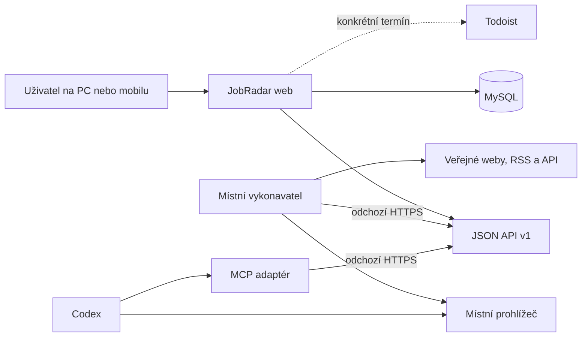

# JobRadar – kompletní implementační plán

### Příprava, odeslání a čekání na odpověď (9. 9. 2026)

Migrace `016_application_workflow.sql` zavádí auditované idempotentní události reakce. `prepared` znamená `awaiting_approval`; `submitted` pouze eviduje skutečně doložené schválené odeslání a nastaví `awaiting_response`. Vyžaduje potvrzení, odkaz na schválení, skutečný čas, kanál a zvolený termín kontroly odpovědi. Nic neposílá. Atomicky dokončí výslovně vybrané přípravné úkoly a založí jeden `follow_up`. Opakování stejného klíče vrátí původní výsledek; jiný obsah, zastaralá verze nebo nepovolený přechod se odmítnou. `response_received` a `closed` ukončí jen vlastní připomínku vytvořenou při odeslání. Rozhodnutí nabídky zůstává zachováno.

Přehled K reakci (web i MCP) zahrnuje jen `none`, `preparing`, `awaiting_approval`. Nová stránka Čekáme na odpověď ukazuje `submitted` / `awaiting_response`. Detail nabízí formulář i historii. API `POST /applications/events` a MCP `record_application_event` vyžadují oddělený scope `applications:write`; synchronizační a vykonávací token tento scope nemají. Detail API vrací historii a navazující úkoly vlastníka.

Todoist synchronizace navíc čte `GET /action-items/linked`: otevřené propojené kroky a uzavřené kroky s dosud nepotvrzenou synchronizací. Pro ověřené uzavření používá `POST /action-items/synced`. Hotový lokální krok se uzavře v Todoistu; ověřeně hotový Todoist krok se uzavře jen jako action_item. Dokončení přípravy se vybírá explicitně, nikoli odhadem podle názvu. Pracovní postup pro soukromý projekt je v `docs/application-workflow.md`.

Integrace navazujících úkolů a hranice soukromých podkladů popisuje [cílové workflow](target-workflow.md). Přenos do externího správce úkolů vyžaduje souhlas vlastníka instance.

Tento dokument popisuje produkt. Stav konkrétního nasazení a provozní ověření patří do soukromé evidence.

## 1. Cíl

### Přímé převzetí aplikací a vícekroková zadání (9. 9. 2026)

- Volitelná klasifikace rozlišuje placenou péči o existující aplikaci a roli protistrany. Zaměření hledání určuje vlastník v soukromé konfiguraci.
- Zdroje mají nezávislé kombinovatelné štítky klientských poptávek, kontraktů, pracovních nabídek a subdodávek. A/B/C a předvolby se nemění.
- Jedna připnutá definice na zdroj obsahuje uspořádané kroky (`steps_json`): klíč, název, dotaz, režim keywords/category/skill, filtry a dílčí limit. Společný limit se nezvětšuje počtem kroků. Původní definice bez kroků používají dosavadní protokol.
- Webová správa ukládá novou verzi přes oprávnění administrátora, optimistický zámek a audit s doložením podporovaného hledání. Staré požadavky se nepřepínají na novou verzi. Konfigurace nevytváří kontroly.
- Vykonavatel ukládá monotónní kumulativní počty a checkpoint jednotlivého kroku. Importy mají kontext searchStep, zdrojový i dílčí limit a společnou deduplikaci. Dokončení vyžaduje všechny kroky terminální; po vyčerpání společného limitu se zbývající kroky označí jako neprocházené kvůli limitu, nikoli jako zkontrolované.
- Protistrana je nezávislá verzovaná klasifikace owner/supplier/recruiter/neověřeno. Známé hodnoty vyžadují důkaz, jistotu a čas, vždy s vazbou na verzi nabídky. Vynechání v importu historii nemění. Detail a přehled umožňují kombinovat filtr péče s rolí protistrany.
- Hodnocení ověřuje důvod změny dodavatele, práva/přístupy ke kódu, předání, technický stav, dokumentaci, testy, nasazení, zálohy, naléhavost, provoz, pohotovost a placený vstupní audit; neznámé skutečnosti jsou otázky. Žádné nové bodové váhy ani automatické oslovení.
- Postup konfigurace, API kontrakty a ověření: `docs/direct-takeover.md`. Reálný pilot se provádí až na samostatný výslovný požadavek.

### Předvolby, ruční Google a péče o aplikace (9. 9. 2026)

- Nový formulář vybírá kontrolovatelné A; konkrétní odkaz vybírá jen daný zdroj. Jen A nahrazuje výběr, Přidat B/C jej rozšiřuje, Vše/Nic pracuje pouze s kontrolovatelnými zdroji. Návrat a chyby zachovají výběr. Spuštění zůstává explicitní a idempotentní.
- Administrátor upravuje A/B/C přes CSRF formulář, optimistický zámek a audit staré/nové priority. Řazení je priorita, název, ID.
- `manual_search` má oddělenou sekci s pojmenovanými verzovanými dotazy. Poslední verze může být deaktivovaná. Otevření dotazu není kontrolou a ruční zdroj nelze zařadit do vykonavatele. Nález ukládá původní detail/URL a vazbu na definici dotazu; deduplikace používá cílovou URL.
- Klasifikace péče o existující aplikaci je tříhodnotová s append-only historií, vazbou na verzi nabídky, původem, jistotou a časem ověření. Chybějící klasifikace při importu zachová předchozí stav. Změna neprovádí uživatelské rozhodnutí.
- Převzetí znamená placenou správu/vývoj, nikoli koupi projektu. Hodnocení zahrnuje předání, dokumentaci, testy, stav aplikace, provoz, pohotovost a placený audit. Neznámý rozsah neumožňuje převod projektového rozpočtu na hodinovou sazbu.
- Příprava přihlášení je ve webu předvolena. Vykonavatel otevře při vyžádané práci přístupové stránky v Chrome – Práce a uloží pouze pozorovaný stav přístupu. Po přípravě všech zdrojů uvolní lease a čeká na potvrzení vlastníka v detailu téhož požadavku. Až poté smí začít kontroly. Příprava nikdy nezapisuje počty nálezů ani úspěšnou kontrolu. Hesla/MFA/správce hesel obsluhuje uživatel v Chrome.
- Starší API požadavky bez `prepare_access` zachovávají původní tok. Testy vyžadují APP_ENV=test a oddělenou DB_NAME=jobradar_test[_suffix]; běžná DB je odmítnuta před spuštěním testů.

### Přestavba vykonavatele (8. 9. 2026)

Součástí navržené přestavby je přehled neprověřených a částečně prověřených zdrojů přímo na dashboardu vedle relevantních nabídek: s důvodem, posledním pokusem, posledním úplným úspěchem a možností výslovně vyžádat pokračování nebo novou kontrolu. Neznámý výsledek se nesmí zobrazovat jako nulový počet nálezů; přehled a pokrytí se odvozují z databázových výsledků zdrojů.

Přestavba kontrol na Codex Desktop automatizaci je rozpracována v [plánu integrace](codex-desktop-execution-plan.md). Implementace a provozní smlouva jsou v [dokumentaci vykonavatele](executor.md), konkrétní výsledky a zbývající ověření v [protokolu ověření](execution-verification.md). Implementováno je vykonávací API/MCP, obnovování přidělení, checkpointy, idempotentní importy/posouzení a přehled neúplných zdrojů. Import soukromé konfigurace nespouští hledání. Produkční procházení portálů ještě vyžaduje skutečné plánované ověření a pilot. Dosavadní demonstrační CLI worker je vypnutý, jeho claim endpoint vrací 410; falešný adaptér zůstává pouze v testech.

Vykonávací MCP používá jediný scope `search:execute`, oddělený token, API v1 a vlastníka přiděleného zařízení. Nové ruční požadavky mají `executor_eligible = 1`; staré požadavky se bez potvrzení nepřebírají. Při vytvoření se připíná aktivní definice každého zdroje, při prvním převzetí platná verze profilu a pravidel vlastníka. Přednost mají aktivní pravidla; pokud nejsou, poslední návrh umožňuje pouze kvalitativní posouzení bez číselných skóre a vah. Obnova nemění připnuté ID. Úplný průchod vyžaduje konfiguraci, uložený checkpoint a doložené počty; bez konfigurace je zdroj neprověřený s důvodem. Přihlášení jednoho zdroje nezastavuje další dostupné zdroje. Souhrn dashboardu má disjunktní kategorie úplné / částečné / neprověřené / čekající či probíhající. Nevyřešené zdroje se hledají napříč požadavky daného uživatele.

JobRadar bude responzivní self-hosted PHP aplikace s MySQL. Software bude zveřejněn pod licencí MIT zatímco každá nasazená instance a její uživatelská data zůstanou soukromé. Z jednoho místa zpřístupní nabídky, jejich české překlady, hodnocení, rozhodnutí, průběh žádostí a důkaz o tom, které zdroje byly skutečně zkontrolovány. Bude použitelná z počítače i mobilu.

Aplikace je jediným zdrojem pravdy pro:

- seznam sledovaných zdrojů a jejich prioritu;
- stav přístupu a informaci, kde se musí uživatel přihlásit;
- jednotlivé ručně spuštěné kontroly a jejich skutečné pokrytí;
- nalezené nabídky, originál, český překlad a verze zdrojového textu;
- posouzení, skóre, doporučení a konečné rozhodnutí;
- frontu nabídek k reakci, stav žádostí a navazující akce;
- měření užitečnosti a nákladů jednotlivých zdrojů.

Todoist zůstane pouze volitelným kanálem pro konkrétní úkoly a termíny. Nebude evidencí nabídek ani náhradou JobRadaru.

### 1.1 Veřejný software a soukromá data

- Veřejný repozitář smí obsahovat zdrojový kód, migrace, dokumentaci, syntetické fixtures a obecné definice adaptérů.
- Nesmí obsahovat reálný profil kandidáta, životopis, nabídky, obsah komunikace, databázové dumpy, logy, tokeny, cookies ani lokální konfiguraci s tajemstvími.
- Ukázková konfigurace musí používat zjevně neprodukční hodnoty a syntetická data. Lokální a produkční data budou ignorována Gitem již od prvního commitu.
- Před prvním veřejným releasem se zkontroluje celá Git historie na tajemství a osobní údaje a doplní se anglická i česká dokumentace, `SECURITY.md`, `CONTRIBUTING.md`, changelog a veřejné CI.
- Název bude v popisu odlišen podtitulem `privacy-first, self-hosted job opportunity management for humans and AI assistants`, protože na GitHubu existují i jiné projekty nazvané JobRadar.
- Původní pracovní podklady obsahují soukromý provozní kontext, který se do veřejného repozitáře nekopíruje. Jeho bezpečně zobecněné hranice a kontrolní body popisuje `docs/context-boundary.md`.

## 2. Hranice systému

První verze nebude sama bez pokynu pravidelně hledat. Uživatel vždy vytvoří konkrétní ruční požadavek v aplikaci nebo jej výslovně zadá asistentovi. JobRadar nesmí:

- automaticky odeslat pracovní žádost, e-mail nebo zprávu;
- předat osobní údaje třetí straně stisknutím `Reagovat`;
- potvrdit právní podmínky, souhlas se zpracováním údajů nebo elektronický podpis;
- kupovat členství, kredity nebo odemykat kontakt;
- ukládat hesla, cookies, MFA kódy nebo obsah správce hesel pracovních portálů;
- označit plánovaný zdroj jako zkontrolovaný bez skutečného průchodu.

`Reagovat` znamená pouze zařazení do interní fronty. `Nezajímavé` nabídku skryje z výchozího přehledu, ale nesmaže ji a lze je vrátit zpět.

## 3. Profil a hodnoticí pravidla

Profil a hodnoticí pravidla jsou verzované soukromé záznamy v databázi. Produkt nemá výchozí osobní profil ani konkrétní finanční, jazykové či geografické preference. Konfigurace může obsahovat ověřenou praxi, technologie, dostupnost, pracovní dobu, místo, jazyky, způsob spolupráce, sazby a vyřazovací podmínky. Každé pravidlo má původ a platnost; preference není ověřený profesní fakt.

Import přes `assessment:import-config` nebo správní `executor-admin.php import-config` načítá soukromý soubor mimo verzování. Veřejné fixtures jsou syntetické. Chybějící údaj není překážka ani shoda: vytvoří otázku k ověření a sníží pokrytí hodnocení.

## 4. Technická architektura

### 4.1 Komponenty

1. **Webová aplikace** – PHP 8.4, Nette 3.x, Latte, Bootstrap 5.3, serverem renderované mobilní rozhraní, Naja pro dílčí AJAX aktualizace a malé ES moduly pro filtry, průběh a rychlá rozhodnutí.
2. **Databáze** – MySQL 8.4, `utf8mb4`, transakce InnoDB, UTC v databázi a Europe/Prague v uživatelském rozhraní.
3. **Soukromé API** – verzované JSON API `/api/v1`, sdílené doménové služby s webovým rozhraním, OpenAPI popis.
4. **Místní vykonavatel** – proces na domácím počítači. Pouze odchozím HTTPS spojením přebírá ruční požadavky, provádí dostupné adaptéry, zapisuje průběh a nesmí předávat přihlašovací tajemství.
5. **MCP adaptér** – malý místní server nad JSON API. Poskytne Codexu přesně omezené nástroje pro čtení zdrojů a nabídek, import, posouzení a auditovaná rozhodnutí.
6. **Prohlížečové adaptéry** – pracují s místním uživatelským profilem pro zdroje vyžadující přihlášení. Relace zůstávají v prohlížeči.
7. **Veřejné/API adaptéry** – například TED Search API nebo RSS Symfony Jobs. Lze je zpracovat bez přihlášení.
8. **Volitelný Todoist adaptér** – až pro konkrétní další krok nebo termín; odkaz na nabídku zůstává v JobRadaru.

### 4.2 Aplikační a frontendový stack

- Soukromé API bude postavené na `tomaj/nette-api`. Endpointy budou tenké handlery nad stejnými aplikačními a doménovými službami, které používá webové rozhraní.
- Autorizace nebude používat statické ukázkové tokeny knihovny. Vlastní vrstva bude ověřovat hashované tokeny, klienta, scopes, expiraci a odvolání v databázi a zapisovat audit bez tajných hodnot.
- OpenAPI 3.x popis bude verzovaný v repozitáři a jeho shoda s implementací se bude ověřovat kontraktními testy. Starší JSON Schema podpora knihovny nenahrazuje API smlouvu JobRadaru.
- CORS bude ve výchozím nastavení vypnutý. Případné povolené originy musí být explicitní; runner a MCP používají serverové HTTPS požadavky a CORS nepotřebují.
- Web bude serverem renderovaný pomocí Latte. Bootstrap 5.3 poskytne mobile-first layout, formuláře a základní komponenty; vzhled se upraví vlastními SCSS proměnnými, aby aplikace nebyla závislá na výchozím vizuálním stylu Bootstrapu.
- Naja obslouží Nette snippets, rychlá rozhodnutí, průběžné stavy a formulářové interakce. Zbývající klientské chování bude v malých vanilla JavaScript ES modulech bez jQuery.
- Vue ani React nebudou součástí základního stacku. Vue lze později použít jako izolovanou komponentu pro konkrétní složité rozhraní, pokud serverové vykreslení a Naja prokazatelně nestačí; nevznikne kvůli tomu druhá paralelní aplikace bez samostatného architektonického rozhodnutí.

### 4.3 Tok komponent

MCP není podmínkou běhu PHP aplikace. Je doporučeným rozhraním, aby asistent nemusel manipulovat s databází přímo ani křehce ovládat administraci webu.

### 4.4 Přenositelné Docker prostředí

Kořenový `compose.yaml` poskytuje samostatné prostředí bez závislosti na konkrétní cestě, doméně, externí Docker síti nebo reverzní proxy:

- `web`: PHP 8.4 + Apache se sestavenou aplikací;
- `db`: MySQL 8.4 s persistentním named volume;
- web ve výchozím stavu naslouchá pouze na `127.0.0.1`, bind adresa a port jsou nastavitelné přes `.env`;
- veřejnou URL, hesla a případnou integraci s reverzní proxy určuje provozovatel.

Místní vykonavatel a MCP adaptér v cílovém režimu neběží v tomto Docker stacku, protože potřebují místní integraci s Codexem a prohlížečem. Pro integrační testy lze jejich API klienty spustit v CLI režimu s falešným prohlížečovým adaptérem.

## 5. Datový model

Migrace budou verzované a opakovatelné. Cizí klíče, unikátní indexy a audit jsou povinné. Mazání důležitých záznamů bude logické (`archived_at`), pokud právní nebo provozní důvod nevyžaduje fyzické odstranění.

### 5.1 Uživatelé a konfigurace

| Tabulka | Účel a klíčová pole |
|---|---|
| `users` | účet, e-mail/uživatelské jméno, hash hesla, role, locale, timezone, poslední přihlášení, deaktivace |
| `candidate_profiles` | název profilu, verze, platnost od/do, JSON parametrů a lidsky čitelný popis |
| `scoring_rule_sets` | verze vah, finanční křivka, tvrdé překážky, stav návrh/aktivní/archiv |
| `settings` | pouze necitlivé provozní volby; tajemství patří mimo databázové hodnoty exportované do UI |

Soukromý provozní balíček instance obsahuje verzovaný profil, komunikační politiky, schválené šablony, metadata příloh a stav účtů na zdrojích bez autentizačních tajemství. Import probíhá z ignorovaného lokálního souboru s náhledem změn. Fakt kandidáta, preference, šablona a souhlas s konkrétním použitím jsou oddělené informace; žádná z nich sama neopravňuje k odeslání.

### 5.2 Nabídky a jejich verze

| Tabulka | Účel a klíčová pole |
|---|---|
| `companies` | název, normalizovaný název, země, web, velikost pokud doložena, poznámky |
| `opportunities` | typ `offer/company_lead/tender`, společnost, kanonická URL, stav platnosti, datum nalezení, zveřejnění a posledního ověření, aktuální verze, optimistický `lock_version` |
| `opportunity_sources` | vazba nabídky na zdroj, zdrojové ID, URL, první a poslední výskyt; unikátní `(source_id, external_id)` a normalizovaná URL |
| `source_versions` | získaný čas, hash obsahu, jazyk, původní a český titulek, úplný originál, úplný český překlad, shrnutí, stav a metoda překladu, příznak neúplnosti |
| `opportunity_terms` | sazba od/do, měna, jednotka, režim, původ údaje, jistota, kurz a datum kurzu, orientační Kč/h, rozsah, délka, nástup, remote, práce z ČR, lokalita, časové pásmo, pracovní jazyk, komunikační režim |
| `technology_requirements` | technologie, normalizovaný název, povinná/výhoda, doložená zkušenost, význam pro hodnocení |
| `opportunity_questions` | nejasná podmínka, navržená otázka, stav, odpověď, zdroj a datum ověření |
| `duplicate_candidates` | dvojice možných duplicit, důvod/podobnost, stav kontroly a výsledek; bez automatického sloučení pouze podle názvu firmy |

Originál a překlad vždy patří ke konkrétní `source_version`. Nový text nesmí ponechat starý překlad označený jako aktuální.

Neznámé podmínky nabídky jsou v relačním modelu `NULL`; nevytvářejí se z nich nulové sazby, nulový rozsah ani potvrzené boolean hodnoty. Strukturované podmínky jsou svázané s konkrétní `source_version`, aby při změně zdrojového textu zůstal zachovaný jejich původ.

Ruční import normalizuje pouze absolutní HTTP(S) URL bez přihlašovacích údajů, zahazuje fragment a běžné měřicí parametry a řadí zbývající query parametry. Stejná normalizovaná URL vede ke stejné nabídce. Shodný hash původního titulku a textu je idempotentní; změna originálu vytvoří novou `source_version`. Překlad a shrnutí lze k již existující shodné verzi bezpečně doplnit bez vytvoření další verze. Každý import se audituje pouze pomocí interních identifikátorů a výsledku deduplikace, nikoli obsahem nabídky.

Uložení strukturovaných podmínek a technologií vždy míří na aktuální `source_version` a vyžaduje očekávaný `lock_version`. Zastaralý zápis skončí konfliktem bez částečné změny. Neuvedené sazby, rozsah, jistota i možnost práce z ČR zůstávají `NULL`; sazba může být označena textovým původem a číselnou jistotou pouze v rozsahu 0–1. Technologie jsou v rámci verze unikátní podle normalizovaného názvu a celé uložení se audituje bez textu nabídky a důkazů.

### 5.3 Posouzení a rozhodnutí

| Tabulka | Účel a klíčová pole |
|---|---|
| `assessments` | nabídka a její verze, profil, pravidla, skóre min/max, ověřené body, pokrytí, doporučení, jistota, souhrn, autor a čas |
| `assessment_breakdowns` | oblast, váha, body min/max, důkazy a vysvětlení |
| `assessment_findings` | typ `strong_match/acceptable_gap/blocker/question`, text, závažnost a odkaz na podklad |
| `opportunity_recommendations` | `react/uninteresting/verify`, zdůvodnění, původ, model/klient, verze nabídky a platnost |
| `user_opportunity_state` | přečteno, konečné rozhodnutí `undecided/react/uninteresting`, důvod a aktuální workflow |
| `opportunity_decision_history` | každá změna, předchozí/nová hodnota, aktér, důvod, výslovná delegace a čas |
| `decision_delegations` | přesné zadání, rozsah IDs/běh/filtr, profil a pravidla, zadavatel, časové omezení, stav a souhrn výsledků |
| `assistant_actions` | audit MCP/API operací, klient, korelační a idempotency klíč, cílový záznam, výsledek; bez tajných hodnot |

Ruční rozhodnutí uživatele má přednost. Přepočet skóre je nesmí změnit. Asistent může provést konečné rozhodnutí jen v rozsahu aktivní výslovné delegace.

Delegace pro první použitelnou verzi přijímá výhradně explicitní seznam 1–500 nabídek, platí nejvýše sedm dnů a odkazuje na právě platný profil a aktivní pravidla s výslovně schválenou finanční křivkou. Každá nabídka musí mít aktuální posouzení přesně touto dvojicí profilu a pravidel. Dávka musí pokrýt celý seznam bez duplicit a pro každou nabídku uvádí očekávanou verzi uživatelského stavu. Jakýkoli konflikt, neplatnost pravidel nebo změna rozsahu vrátí celou dávku zpět; novější ruční rozhodnutí se proto nikdy částečně nepřepíše. Úspěšná dávka delegaci jednorázově uzavře a uloží pouze auditovatelný souhrn počtu zpracovaných a skutečně změněných nabídek.

Schéma hodnocení a rozhodování vzniká bez přednastaveného aktivního `scoring_rule_set`: konkrétní finanční křivka zůstává návrhem, dokud ji uživatel neschválí. Posouzení je neměnně svázané s verzí nabídky, profilu a pravidel. Aktuální uživatelské rozhodnutí je oddělené od doporučení a každá jeho změna má samostatný historický záznam; frontu k reakci tvoří stav `react` s workflow `none` nebo `preparing`, nikoli doklad o odeslání žádosti.

Uložení posouzení vyžaduje očekávaný `lock_version` nabídky a platný profil. Nové posouzení nemění uživatelské rozhodnutí, pouze superseduje předchozí aktuální posouzení a doporučení. Návrhová pravidla dovolují kvalitativní rozklad, nálezy, pokrytí, jistotu a doporučení, ale nikoli celkové ani dílčí číselné skóre; to je povolené až pro výslovně aktivovanou sadu pravidel. Audit obsahuje jen identifikátory, počty a stav pravidel, nikoli shrnutí, důkazy nebo text nálezů.

Detail nabídky zobrazuje aktuální posouzení odděleně od uživatelského rozhodnutí: doporučení, pokrytí, jistotu, případný rozsah skóre, nálezy a rozbalitelný rozklad. U návrhových pravidel místo čísla výslovně uvádí, že schválené skóre není k dispozici. Text shrnutí, nálezů, vysvětlení a důkazů se vždy escapuje jako nedůvěryhodný obsah.

Soukromý profil kandidáta a návrh pravidel lze založit lokálním příkazem `assessment:import-config <soubor> [--dry-run]`. JSON vyžaduje explicitní názvy a kladné verze, odmítá neznámá pole a existující verzi nikdy nepřepisuje. Příkaz vytváří pravidla výhradně ve stavu `draft` a nemá přepínač pro aktivaci; veřejný repozitář obsahuje jen syntetický příklad bez osobních údajů a skutečný profil patří do ignorované lokální konfigurace.

Posouzení lze před zpřístupněním API uložit lokálně příkazem `assessment:import <soubor> [--dry-run]`. Datový tvar vyžaduje ID a očekávanou verzi nabídky, profil, pravidla, doporučení, pokrytí, jistotu, autora a volitelné rozklady a nálezy. Desetinné hodnoty jsou JSON řetězce, aby se neztratila přesnost. CLI nesmí vydávat vstup za ruční uživatelské posouzení, doporučení nemění rozhodnutí a veřejný příklad používá pouze syntetická data.

Ruční změna rozhodnutí používá vlastní optimistický zámek uživatelského stavu. Každý skutečný přechod zapisuje předchozí i nový stav do historie a lze jej vrátit na `undecided`; opakování stejného stavu i důvodu je idempotentní. `Uninteresting` vyžaduje normalizovaný důvod, skryje nabídku z výchozího uživatelského přehledu, ale záznam ani jeho historii nemaže. Samostatný přehled nezajímavých nabídek vede zpět na auditovaný detail, kde lze stav obnovit. Detail výslovně upozorňuje, že `Reagovat` nic neodesílá. Doménová operace rozhodnutí nevytváří žádost, aplikační událost ani externí úkol a u stavu `react` ponechá workflow na `none`.

Samostatný přehled `K reakci` je pouze interní fronta nabídek s rozhodnutím `react` a zobrazuje jejich nezávislý workflow stav. Nemá ovládací prvek pro odeslání, přijetí podmínek ani předání osobních údajů a stav `none` výslovně neinterpretuje jako podanou žádost.

Detail nabídky obsahuje rozbalitelnou časovou osu ručních rozhodnutí přihlášeného uživatele. Ukazuje předchozí a nový stav, normalizovaný důvod v lidské podobě, soukromou poznámku a čas. Jde pouze o čtecí pohled nad neměnnou historií; text poznámky se escapuje a historie sama nemění rozhodnutí ani workflow.

### 5.4 Zdroje a kontroly

| Tabulka | Účel a klíčová pole |
|---|---|
| `sources` | název, URL, trh, typ, priorita, frekvence, aktivní, přihlášení/placení/kredit, schopnosti adaptéru |
| `source_search_definitions` | dotaz, filtry, uložené hledání, stránkovací strategie, limit a verze definice |
| `source_access_states` | aktuální stav, ověřený čas, původ, přihlašovací URL, profil prohlížeče, bezpečný návod, potřeba zásahu |
| `search_requests` | ruční požadavek, výběr zdrojů, stav, autor, zařízení, čas, idempotency klíč a zrušení |
| `search_runs` | skutečný běh, pravidla/profil, runner, začátek/konec a výsledek `complete/partial/cancelled/error` |
| `search_run_sources` | výsledek jednoho zdroje, dotaz/filtr, projité stránky a časový horizont, počty zobrazených/otevřených/uložených/aktualizovaných/duplicit/vyřazených, chyba a login flag |
| `search_run_opportunities` | vazba běhu a zdroje na nalezenou nebo aktualizovanou nabídku a výsledek zpracování |
| `runner_devices` | identita registrovaného počítače, název, poslední spojení, verze a stav |
| `api_clients` | klient `runner/mcp/integration`, povolené scopes a deaktivace |
| `api_access_tokens` | pouze hash tokenu, prefix pro identifikaci, klient, scopes, vytvoření, expirace, poslední použití a odvolání |

Technický stav přístupu, registrace soukromého účtu a komerční stav zdroje se vedou odděleně. Komerční evidence zachovává neznámou cenu, datum obnovy i automatické prodlužování jako neověřené hodnoty. API ani runner nesmějí koupit přístup, obnovit či zrušit předplatné nebo spotřebovat placený kredit bez samostatného výslovného souhlasu.

Příprava přihlášení zapisuje pozorovaný stav přístupu atomicky také do společné evidence `source_access_states`, včetně času a původu ověření. Záznam přípravy konkrétního požadavku zůstává zachován. Částečný nebo zrušený průchod nemění poslední doložený stav přístupu ani jeho čas; bez předchozího ověření zůstává přístup neznámý. Úplný průchod potvrzuje dostupnost, požadavek přihlášení a chyba aktualizují odpovídající stav. Aktivní zdroje zobrazují české popisky, čas posledního ověření a vysvětlení, že neověřený přístup sám o sobě nevyžaduje přihlášení. Příprava přístupu nikdy neznamená dokončenou kontrolu nabídek.

Evidence kontrol ukládá výběr zdrojů relačně a požadavek identifikuje hashem jednorázového idempotency klíče konkrétního uživatele. Plánovaný zdroj má všechny metriky průchodu `NULL`; nuly lze zapsat až jako skutečný výsledek provedené kontroly. Stav `complete` je oddělený od `planned`, `running`, `partial`, přihlášení a chyby a vyžaduje skutečný rozsah průchodu. Tabulky nikdy neobsahují cookies, hesla ani MFA údaje; u zařízení a lease se ukládají pouze veřejné identifikátory nebo hashe.

Vytvoření ručního požadavku vyžaduje přihlášeného uživatele, neprázdný výběr aktivních nemanuálních zdrojů a jednorázový idempotency klíč. Ukládá se pouze hash klíče. Opakování stejného klíče a stejného výběru vrátí původní požadavek; použití téhož klíče pro jiný výběr skončí chybou. Operace pouze vytvoří stav `waiting_for_runner`, nevytvoří běh a žádný zdroj neoznačí jako prošlý.

Chráněná obrazovka zdrojů ukazuje aktivní kontrolovatelné zdroje, jejich prioritu a poslední doložený stav přístupu. Formulář s CSRF a stabilním idempotency klíčem vytvoří požadavek jen po explicitním odeslání uživatelem; webový proces sám žádný adaptér nespouští. Historie na stejné stránce zobrazuje čekající požadavek a počet plánovaných zdrojů, nikoli tvrzení o jejich provedení.

Registrovaný neodvolaný runner přebírá nejstarší čekající požadavek krátkým pětiminutovým lease. Náhodný lease token se vrátí jen volajícímu runneru a databáze uchovává pouze jeho SHA-256 hash a expiraci. Převzetí vytvoří jeden běh a plánované řádky zdrojů s `NULL` metrikami; stav požadavku je pouze `checking_access`. Po expiraci lze práci bezpečně převzít znovu bez vytvoření druhého běhu.

Aktivní runner obnovuje lease heartbeat operací před vypršením. Obnova vyžaduje stejné zařízení, správný surový lease token a stav `checking_access` nebo `running`; vypršený či terminální lease nelze prodloužit a musí se bezpečně znovu převzít standardním claimem.

Obnovený lease vrací pouze dosud plánované zdroje a zdroje čekající na přihlášení; již terminální výsledky se znovu nepřidělují. Pokud kterýkoli zdroj čeká na přihlášení, dokončení jiného zdroje tento stav požadavku nepřepíše.

Pokud lease vyprší během zpracování zdroje, nové převzetí stejného běhu vrátí pouze tento nedokončený zdroj do stavu `planned` a odstraní jeho nedoložené souhrnné počty. Terminální výsledky ostatních zdrojů ani již uložené vazby `search_run_opportunities` nemaže; starý lease token po převzetí nesmí pokračovat v zápisu.

API klient typu `runner` je svázaný právě s jedním záznamem `runner_devices`; klient jiného typu ani runner bez aktivního zařízení nesmí převzít či obnovit lease. Administrátorský CLI příkaz vytváří runner klienta, jeho zařízení a první token v jedné transakci.

Runner se scope `search:write` přebírá práci přes `POST /api/v1/runner/lease`; prázdná fronta vrací úspěšnou odpověď s `data: null`. Surový lease token se vrací jen při převzetí a heartbeat `POST /api/v1/runner/lease/renew` jej musí znovu doložit spolu s ID požadavku. API Bearer token a krátkodobý lease token mají oddělený účel i životní cyklus.

`POST /api/v1/search-runs/{id}/sources/{sourceId}/progress` přijímá událost `start` s popisem skutečného rozsahu nebo `finish` s výsledkem a nullable metrikami. Neznámá pole odmítá, ISO-8601 horizont validuje a všechny přechody, lease i požadavek úplných počtů pro `complete` prosazuje doménová služba.

Runner musí každý zdroj nejprve přepnout z `planned` na `running` a uložit popis skutečného rozsahu, filtry a případný časový horizont. `Complete` lze zapsat jen pro zahájený zdroj s počtem projitých stránek a všemi výslednými počty; skutečná nula je pak platný doložený výsledek. `Partial`, `waiting_for_login` a `error` vyžadují důvod, chyba navíc bezpečný kód. Po posledním terminálním zdroji se stav běhu odvodí z jednotlivých výsledků a lease hash se odstraní.

Pokračování po přihlášení je samostatná výslovná uživatelská operace dostupná pouze ze stavu `waiting_for_login`; nastaví `resume_requested` a zneplatní starý lease, ale sama přístup neprohlašuje za ověřený. Zrušení je idempotentní, ukončí otevřené plánované nebo běžící zdroje a odstraní lease. Již terminální výsledky a importované nabídky zachová; dokončenou kontrolu nelze zpětně přepsat na zrušenou.

Jádro lokálního workeru závisí pouze na verzovaném API klientovi a explicitně registrovaných adaptérech, takže nemá přímý přístup k MySQL. Každý přidělený zdroj zapisuje zahájení s konkrétním rozsahem a výsledný stav s doloženými nebo neznámými počty. Falešný adaptér obsluhuje výhradně syntetický typ `fake` pro testy; chybějící či havarující adaptér se pravdivě uloží jako chyba bez tvrzení, že externí obsah proběhl, a bez zapsání nedůvěryhodné chybové zprávy.

Původní demonstrační `runner:work-once` je od přestavby na Codex Desktop vypnutý. Provozní vykonavatel je STDIO MCP s `search:execute` popsaný výše a v `docs/executor.md`; původní HTTP klient a falešný adaptér slouží pouze regresním testům. Provozní HTTP klient nesleduje přesměrování, pro vzdálené adresy vyžaduje HTTPS a přijímá pouze očekávaný JSON kontrakt.

### 5.5 Žádosti a úkoly

| Tabulka | Účel a klíčová pole |
|---|---|
| `applications` | nabídka, kanál, stav, sazba uvedená v žádosti, dostupnost, datum odeslání a vazba na existující Markdown evidenci |
| `application_workflow_history` | změny stavů, potvrzení systému, podstatné odpovědi, souhlasy a podmínky bez zbytečných osobních údajů |
| `action_items` | konkrétní další krok, termín, stav, priorita a vazba na nabídku/žádost |
| `external_tasks` | provider, externí ID/URL, poslední synchronizace; pro volitelné propojení Todoistu |
| `audit_log` | bezpečnostně a provozně významné změny webu i API |

## 6. Stavové automaty

### 6.1 Rozhodnutí

`undecided -> react | uninteresting`
`react -> undecided | uninteresting`
`uninteresting -> undecided | react`

Každý přechod vytvoří historii. Po rychlém kliknutí se zobrazí možnost `Zpět`. U `Nezajímavé` lze doplnit důvod: nízká sazba, rozsah, nelze remote, jazyk/komunikace, technologie, WordPress/malý web, neaktuální, duplicita nebo jiný.

### 6.2 Průběh žádosti

`none -> preparing -> awaiting_approval -> submitted -> awaiting_response -> response_received -> closed`

Stav rozhodnutí, platnost nabídky, přečtení a workflow jsou nezávislé osy. Nabídka může být například `react`, `active`, `read`, `awaiting_approval`.

### 6.3 Ruční kontrola

`waiting_for_runner -> checking_access -> running -> waiting_for_login -> resume_requested -> running -> complete|partial|cancelled|error`

Zrušení zastaví budoucí kroky, ale nemaže již uložené nabídky ani historii. Jeden uživatel nesmí dvojitým kliknutím vytvořit dva souběžné stejné požadavky.

## 7. Ruční kontrola zdrojů

1. Uživatel v aplikaci stiskne **Spustit úplnou kontrolu**, případně vybere jen některé nebo dříve nedokončené zdroje.
2. Server vytvoří `search_request` ve stavu `waiting_for_runner`.
3. Místní vykonavatel požadavek převezme, zamkne lease a předběžně ověří přístup ke zdrojům s přihlášením.
4. Dostupné zdroje zpracuje. Jeden blokovaný zdroj nezastaví ostatní.
5. Aplikace průběžně ukazuje stav a nabídky ukládá po dokončených jednotkách práce.
6. Zdroje blokované přihlášením, MFA nebo CAPTCHA zobrazí aplikace v jednom seznamu s přímými odkazy a bezpečnou instrukcí.
7. Uživatel se přihlásí v místním prohlížeči a stiskne **Ověřit přihlášení a pokračovat**. Tlačítko pouze vytvoří požadavek na nové ověření.
8. Vykonavatel relaci skutečně ověří a dokončí zbývající zdroje.
9. Běh skončí jako úplný nebo částečný se souhrnem plánovaných a skutečně provedených zdrojů.

Požadavek lze vytvořit z mobilu. Bez zapnutého registrovaného počítače zůstane čekat a UI ukáže poslední spojení runneru. Vykonavatel navazuje jen odchozí spojení; domácí počítač neotevírá příchozí port do internetu.

## 8. Získání, normalizace a verzování nabídky

Pro každý kandidát platí:

1. uložit zdrojovou URL, externí ID a čas nalezení;
2. otevřít celý detail; název nebo výpis nestačí pro konečné hodnocení;
3. získat co nejúplnější text, titul, firmu, datum, sazbu, rozsah a podmínky;
4. odstranit pouze navigační šum, zachovat význam nabídky a uložit hash normalizovaného obsahu;
5. identifikovat duplicitu nejprve podle `(source, external_id)`, potom normalizované URL, následně pouze navrhnout podobnost mezi portály;
6. při změně hashe vytvořit novou verzi, nikoli přepsat historii;
7. přeložit titul a celý dostupný text do češtiny a vytvořit zvláštní stručné shrnutí;
8. strukturovat podmínky s původem a jistotou;
9. vyhodnotit profil a uložit důkazy pro každý závěr;
10. propojit nabídku s konkrétním během a výsledkem zdroje.

Každý úplný detail otevřený při hledání se uloží alespoň v minimální podobě i při zamítnutí: originální a český titul, URL, datum, důvod a dostupný text. To dovolí nabídky po změně pravidel znovu posoudit.

Externí HTML se nebude ukládat jako vykonatelný obsah. Před zobrazením se převede na bezpečný text nebo sanitizovaný omezený markup. Text nabídky je nedůvěryhodný a nesmí řídit runner, MCP ani asistenta.

## 9. Skórování

Skóre má rozsah 0–100 a viditelný rozklad:

Oblasti, váhy i minima určuje schválená soukromá verze pravidel. Žádné konkrétní rozdělení není osobním výchozím nastavením produktu.

Každá oblast ukládá minimum, maximum a ověřené body. Příklad: známé oblasti dávají 45 z 60 ověřitelných bodů a 40 bodů zůstává neověřených; UI zobrazí rozsah 45–85 a pokrytí 60 %, nikoli jistých 85.

Finanční funkce musí být monotónní: vyšší srovnatelná hodinová sazba nikdy nesníží skóre. Potvrzená sazba se porovnává s minimem v připnuté verzi pravidel; rovnost s minimem je přípustná. Odhad, nabídnutá sazba a vlastní cíl jsou odlišná pole. Zaměstnanecká mzda, B2B sazba a projektový rozpočet se nesrovnávají bez zapsaných předpokladů.

První aktivní `scoring_rule_set` vznikne až po schválení konkrétní bodové křivky sazeb. Do té doby lze ukládat rozklad a doporučení, ale delegovaná dávková rozhodnutí podle celkového skóre zůstávají vypnutá.

Potvrzená zásadní překážka má samostatný příznak a vysvětlení. Vysoká sazba ji nezakryje. Nejasná podmínka vytvoří otázku a může vést k `Nutno ověřit`.

## 10. Rozhodování asistenta

### 10.1 Doporučovací režim

Výchozí režim. Asistent načte aktuální úplný detail, uloží skóre, silné shody, přijatelné mezery, překážky, otázky a doporučení `Reagovat`, `Nezajímavé` nebo `Nutno ověřit`. Konečné rozhodnutí se nezmění, dokud je uživatel nepotvrdí.

### 10.2 Delegované rozhodnutí

Uživatel může výslovně požádat, aby asistent rozhodl za něj. Delegace musí být omezena konkrétním během, seznamem nabídek nebo uloženým filtrem a musí uvádět verzi profilu a pravidel. Asistent poté může nastavit `Reagovat` nebo `Nezajímavé`; poctivě nerozhodnutelnou nabídku ponechá jako `Nutno ověřit`.

Implementovaná první varianta delegace záměrně podporuje jen nejpřesnější rozsah `opportunity_ids`; rozsahy běhu a uloženého filtru zůstávají navazujícím rozšířením. Delegaci lze vytvořit pouze pro již posouzené nabídky, s aktivními pravidly a schválenou finanční křivkou. Pro ponechání nabídky k ověření dávka zopakuje stav `undecided`, takže nevytváří falešné konečné rozhodnutí.

API pro změnu vyžaduje `expected_lock_version`. Pokud uživatel mezitím záznam změnil, zápis skončí konfliktem a nic nepřepíše. Každé delegované rozhodnutí ukládá původní zadání, autora, čas, nabídku/verzi, důvody a výsledek.

Ani delegované `Reagovat` nic neodesílá. Příprava textu, kontrola odpovědí formuláře, právní souhlasy a skutečné odeslání zůstávají oddělené.

## 11. Uživatelské rozhraní

Rozhraní bude mobile-first, s klávesovou obsluhou a sémantickým HTML. Důležité stavy nesmějí být vyjádřeny jen barvou.

1. **Přehled** – nové a nepřečtené nabídky, český titulek, firma, země, skóre/rozsah a pokrytí, sazba, rozsah, hlavní nejasnost a trvale viditelná tlačítka `Reagovat` a `Nezajímavé`.
2. **K reakci** – rozhodnutí `Reagovat`, priorita, datum, nevyřešené otázky a aktuální stav přípravy či žádosti.
3. **Detail nabídky** – shrnutí a posouzení; záložky celý český překlad/originál; zdroj a verze; podmínky; rozklad skóre; nejasnosti; rozhodnutí a historie.
4. **Zdroje** – registry zdrojů, priorita, doporučená frekvence, přístup, placení, poslední pokus/úspěch/nález, stáří, návod a přihlašovací URL.
5. **Kontrola** – `Spustit úplnou kontrolu`, výběr zdrojů, živý průběh, blokovaná přihlášení, `Ověřit přihlášení a pokračovat`, `Zrušit kontrolu` a závěrečné pokrytí.
6. **Historie běhů** – plánované versus skutečně zkontrolované zdroje, dotazy, rozsah, počty, chyby a nalezené nabídky.
7. **Nezajímavé** – skryté záznamy, důvody, filtry a obnova rozhodnutí.
8. **Žádosti** – interní fronta, příprava, schválení, odeslání, potvrzení a odpovědi.
9. **Nastavení** – profily a pravidla, zdroje, zařízení, API klienti, odvolání tokenu, případné Todoist propojení a export.

Dashboard ukáže například: `14 z 18 zdrojů zkontrolováno, 3 vyžadují přihlášení, 1 chyba`. Zastaralý zdroj se určí podle jeho vlastní doporučené frekvence.

Dashboard zobrazuje doložené pokrytí nejnovější kontroly uživatele a odkaz na její detail. Registr zdrojů odlišuje poslední skutečný pokus, poslední úplný úspěch a poslední nalezenou nabídku; zdroj s nastavenou frekvencí je zastaralý, pokud nikdy neměl úplný úspěch nebo od něj tato doba uplynula.

Detail ručně vyžádané kontroly je dostupný pouze jejímu uživateli a odděluje plánované zdroje od skutečně zahájených a úplně dokončených průchodů. Zobrazuje uložený rozsah, časový horizont, nullable počty, bezpečné kódy chyb a důvody nedokončení; neznámý počet se nezobrazuje jako nula. Pokračování po přihlášení i zrušení jsou výhradně CSRF chráněné POST operace a procházejí stavovým automatem. Přihlášení probíhá přímo v místním prohlížeči a JobRadar nepřebírá jeho tajemství.

První přírůstek etapy 2 poskytuje chráněný formulář ručního importu, přehled aktuálních verzí, detail nabídky s rozbalitelnou historií všech zdrojových verzí a editaci strukturovaných podmínek a technologií. Formulář vyžaduje URL, původní titulek a původní text; společnost, jazyk, překlad a shrnutí jsou volitelné a prázdné hodnoty zůstávají neznámé. Délkové limity jsou vynucené ve formuláři i doménovém vstupu pro budoucí API. Detail zobrazuje originál i překlad jako prostý escapovaný text se zachováním řádků a neznámé podmínky výslovně odlišuje od záporných hodnot. Externí odkaz se otevírá odděleně a import ani detail neprovádějí žádnou reakci na nabídku.

JSON import je dostupný z CLI jako `opportunity:import-json <soubor> [--dry-run]`. Přijímá jeden objekt nebo pole objektů do 10 MiB, nejprve validuje celý datový tvar a neznámá pole odmítne, aby překlep nezpůsobil tichou ztrátu údaje. Importovaný text je stále pouze nedůvěryhodný obsah a prochází stejnou doménovou službou, deduplikací a auditem jako webový formulář.

## 12. Soukromý registr zdrojů

Vlastník konfiguruje zdroje, priority A/B/C, účty, rozsah oprávněného přístupu, dotazy a limity ve své databázi. Produkt neobsahuje seznam jeho portálů ani potvrzení registrací či předplatného. Obecné adaptéry nesmějí implicitně aktivovat zdroj. Omezený bezplatný výběr lze zkontrolovat, pokud odpovídá připnutému zadání; úplnost se vztahuje výhradně k doloženému rozsahu.

## 13. API a MCP smlouva

API používá JSON, UTC ISO-8601, stabilní chybové kódy, cursor pagination a request ID. Měnící požadavky mají idempotency klíč a u existujícího záznamu očekávanou verzi.

Základní API:

- `GET /api/v1/sources` a `GET /api/v1/sources/requiring-login`;
- `POST /api/v1/search-requests`, `POST /{id}/resume`, `POST /{id}/cancel`, `GET /{id}`;
- `POST /api/v1/search-runs/{id}/sources/{sourceId}/progress`;
- `POST /api/v1/opportunities/import` a `POST /api/v1/opportunities/{id}/versions`;
- `GET /api/v1/opportunities`, `GET /api/v1/opportunities/{id}`;
- `POST /api/v1/opportunities/{id}/assessments`;
- `POST /api/v1/opportunities/{id}/recommendations`;
- `PUT /api/v1/opportunities/{id}/decision` a auditovaná dávková varianta;
- `GET/POST /api/v1/decision-delegations`;
- `GET/POST /api/v1/applications` a změny workflow;
- `GET /api/v1/audit` pro administrátora.

První zapojený endpoint je read-only `GET /api/v1/sources`. Obsluhuje jej tenký handler `tomaj/nette-api`, vyžaduje Bearer token se scope `sources:read`, nevrací interní ruční zdroj a zachovává neověřený stav přístupu jako `unknown`. CORS zůstává vypnutý a smlouva je verzovaná v `docs/openapi.yaml`.

`GET /api/v1/sources/requiring-login` vrací jednotný checklist aktivních zdrojů, jejichž poslední doložený stav vyžaduje přihlášení nebo jiný zásah uživatele. Sdílí datový tvar se seznamem zdrojů a samotné načtení nic nespouští ani přístup neoznačuje za ověřený.

API nabídek odděluje čtecí scope `opportunities:read` od zápisového `opportunities:import`. `GET /api/v1/opportunities` a `GET /api/v1/opportunities/{id}` vracejí globální nabídky spolu se stavem rozhodnutí vlastníka tokenu. `POST /api/v1/opportunities/import` přijímá právě jednu nabídku, odmítá neznámá pole a používá stejnou validaci, normalizaci URL, deduplikaci, verzování a audit jako CLI a web. Text nabídky zůstává nedůvěryhodným obsahem a import nikdy nemění rozhodnutí ani workflow odeslání.

`PUT /api/v1/opportunities/{id}/decision` je pouze pohodlná varianta pro delegaci obsahující přesně jednu nabídku. Vyžaduje scope `decisions:write`, ID aktivní delegace, očekávanou verzi stavu a idempotency klíč vázaný na klienta i přesný obsah operace. Změna se historizuje s aktérem `assistant` a odkazem na delegaci; bez delegace nebo při zastaralé verzi se nic nezmění. Ani rozhodnutí `react` nemění workflow na odesláno, nevytváří žádost a v odpovědi výslovně potvrzuje `application_submitted: false`.

`POST /api/v1/decision-delegations` vyžaduje silnější samostatný scope `decisions:delegate` a s klientskou idempotencí vytvoří časově omezené oprávnění nad přesným seznamem nabídek. Běžný rozhodovací MCP token tak delegaci sám nevytvoří, pokud mu uživatel toto oprávnění výslovně nevydá. `POST /api/v1/decision-delegations/{id}/decisions` se scope `decisions:write` přijme právě jednu atomickou dávku odpovídající celému rozsahu; při zastaralém zámku neprovede žádnou položku. Oba endpointy odvozují vlastníka z tokenu, odmítají neznámá pole a výslovně vracejí `application_submitted: false`.

`POST /api/v1/opportunities/{id}/assessments` se scope `assessments:write` používá shodný klientský idempotency záznam a `lock_version` nabídky. Identitu autora nelze podvrhnout tělem: API ji nastavuje na `assistant` a vyžaduje identifikátor modelu. Uložené vysvětlitelné posouzení vytvoří samostatné doporučení, ale nikdy samo nezmění uživatelské rozhodnutí ani nevytvoří či neodešle žádost.

Detail nabídky vrací také `current_assessment` včetně skóre, pokrytí, profilu, verze pravidel, rozkladu a nálezů; bez posouzení je hodnota `null`. Klient tak může bezpečně ověřit uložený výsledek bez dalšího přístupu k databázi.

Dashboard i seznamové API zobrazují u každé nabídky aktuální sazbu, rozsah práce, rozsah skóre, procento pokrytí a doporučení. Chybějící hodnoty zůstávají `null` a rozhraní je označuje jako neznámé nebo nevypočtené; nikdy je nenahrazuje nulou.

Každá karta dashboardu má vlastní CSRF chráněný formulář rychlého rozhodnutí vytvořený Nette `Multiplierem`. Odesílá očekávanou verzi stavu, u `Nezajímavé` vyžaduje doménově platný důvod a nabízí vratné `Zpět`; používá tutéž službu a historii jako detail. Ani rychlé `Reagovat` nemění workflow odeslání.

API kontroly zdrojů používá scope `search:control` a identitu vlastníka odvozuje výhradně z ověřeného klienta, nikdy z těla požadavku. `POST /api/v1/search-requests` vyžaduje explicitní výběr zdrojů a idempotency klíč; `GET /api/v1/search-requests/{id}` nezpřístupní cizí kontrolu. Endpointy `/{id}/resume` a `/{id}/cancel` pouze volají stejný stavový automat jako web a zachovávají již uložené výsledky.

První klient a jeho časově omezený token se vytvářejí přes administrátorský CLI příkaz `api:create-client`. Příkaz vyžaduje existující aktivní administrátorský účet, explicitní typ, nejméně jeden podporovaný scope a platnost 1–365 dnů; vytvoření klienta a tokenu je atomické a surový token se vypíše pouze v tomto kroku.

Počáteční MCP nástroje budou mapovat doménové operace, nikoli obecný SQL nebo libovolný HTTP přístup:

- `list_sources`, `list_sources_requiring_login`;
- `request_search`, `resume_search`, `cancel_search`, `get_search_status`;
- `list_opportunities`, `get_opportunity`, `import_opportunity_version`;
- `save_assessment`, `propose_decision`, `set_decision`, `set_decisions_batch`;
- `list_reaction_queue`, `record_application_event`.

MCP server používá oficiální PHP SDK, standardní řádkový STDIO transport a vlastní `JOBRADAR_MCP_TOKEN`. Přes úzce vymezeného HTTP klienta volá pouze cesty `/api/v1`; nebootuje databázovou vrstvu a nevystavuje obecný HTTP ani SQL nástroj. Implementované nástroje pokrývají zdroje, řízení kontrol, nabídky, frontu k reakci, import verze, posouzení, vytvoření výslovné delegace a atomické jednotlivé i dávkové rozhodnutí. Schémata mutací vyžadují stejné idempotency klíče, ID delegace a očekávané verze jako API; popisy a anotace nástrojů výslovně uvádějí vedlejší účinky a zákaz odeslání žádosti. Scope `decisions:delegate` je oddělený a běžnému MCP tokenu se nevydává, pokud uživatel nechce delegace vytvářet výslovným pokynem přes tento klient.

Scopes se oddělí minimálně na `sources:read`, `search:control`, `search:write`, `opportunities:read`, `opportunities:import`, `assessments:write`, `decisions:recommend`, `decisions:delegate`, `decisions:write`, `applications:write` a `audit:read`. Runner nepotřebuje `decisions:write`; běžný rozhodovací klient nepotřebuje `decisions:delegate` a doporučovací klient nepotřebuje `applications:write`.

## 14. Přihlášení a bezpečnost

- Produkce pouze přes HTTPS; secure, HttpOnly a SameSite cookies.
- Hesla uživatelů přes `password_hash()` s aktuálním bezpečným algoritmem; ochrana proti hrubé síle a regenerace session ID.
- CSRF tokeny pro webové mutace, parametrizované SQL, výstupní escapování a přísná sanitizace externího obsahu.
- Content Security Policy, `X-Content-Type-Options`, vhodný `Referrer-Policy` a zákaz indexace.
- API token zobrazit jen při vytvoření, ukládat jen hash a krátký prefix; samostatná expirace, scopes a odvolání.
- API klienti typu runner, MCP a obecná integrace mají vlastní veřejný identifikátor a oddělené tokeny. Vydaný token má prefix `jr_`, jeho plná hodnota se vrací pouze při vytvoření a autentizace odmítá expirovaný či odvolaný token, odvolaného klienta i chybějící scope.
- Žádné přímé připojení MCP/runneru k MySQL.
- Databázi nevystavovat veřejně; konfigurace reverzní proxy patří provozovateli mimo repozitář.
- Citlivé produkční hodnoty v environment/secrets mimo Git a webroot.
- Audit přihlášení, změn pravidel, delegací, rozhodnutí, API klientů, importů a workflow žádostí.
- Export a zálohy šifrovat podle cílového hostingu; pravidelně ověřit obnovu.
- CLI záloha používá konzistentní `mysqldump`, heslo předává pouze prostředím podřízeného procesu, vytváří soubor atomicky a existující soubor nikdy nepřepíše. CLI obnova přijme čitelný SQL soubor pouze tehdy, když cílové MySQL schéma neobsahuje žádnou tabulku; tím vylučuje nechtěné přepsání živé instance a umožňuje opakovatelný test obnovy do čisté databáze.
- Logy nesmějí obsahovat tokeny, cookies, celé osobní kontakty ani obsah autentizačních hlaviček.

## 15. Todoist

Todoist se použije jen pro úkol s konkrétní akcí nebo termínem, například:

- ověřit sazbu či remote podmínky;
- zkontrolovat připravenou žádost;
- odpovědět náboráři do data;
- provést follow-up několik dní po odeslání;
- přihlásit se na portál, pokud zásah nelze dokončit ihned.

Označení `Reagovat` samo úkol nevytvoří. Integrace uloží provider, externí ID a URL, aby nevznikaly duplicity. Dokončení úkolu může uzavřít pouze `action_item`; nesmí samo změnit rozhodnutí nabídky nebo tvrdit, že žádost byla odeslána.

## 16. Migrace dosavadní evidence

Importér načte Markdown soubory ze soukromého adresáře zvoleného provozovatelem a další potvrzené záznamy. Pro každý soubor:

1. vytvoří nebo dohledá společnost a nabídku;
2. uloží zdroj, datum, kanál a stav;
3. přenese pouze pracovní metadata, sazbu, dostupnost, odpovědi, souhlasy, potvrzení a podmínky;
4. nepřenese telefon, osobní e-mail, úplnou adresu, hesla ani ověřovací kódy;
5. uchová cestu a hash původního souboru kvůli dohledatelnosti;
6. při opakovaném importu aktualizuje tentýž záznam.

Před produkční migrací se vytvoří náhled změn a kontrolní součet. Původní Markdown soubory se nesmažou, dokud nebude ověřena úplnost a záloha.

## 17. Provozní metriky

Pro zdroj sledovat:

- čas strávený kontrolou;
- počet zobrazených kandidátů a otevřených plných detailů;
- nové relevantní nabídky;
- počet `Reagovat`, připravených a odeslaných žádostí;
- věcné odpovědi, pohovory a získané placené zakázky;
- spotřebované kredity, předplatné a další náklady.

Nalezená nabídka ani odeslaná žádost není výnos. Report návratnosti musí oddělit bezplatné a placené funkce a umožnit rozhodnout o obnově předplatného podle výsledků.

## 18. Implementační etapy

### Etapa 0 – základ projektu a vývojové prostředí

- adresář, Git, README, AGENTS a tento plán;
- samostatný Docker Compose stack s PHP 8.4, MySQL 8.4 a health checkem;
- veřejný Docker image a konfigurace nezávislé na umístění repozitáře a zvolené reverzní proxy;
- MIT licence, pravidla pro přispívání a bezpečnostní hlášení;
- ověřit konfigurovatelnou adresu aplikace, databázi a perzistenci volume.

Výstup: reprodukovatelné lokální prostředí bez aplikačních funkcí.

### Etapa 1 – aplikační kostra, přihlášení a migrace

- Nette skeleton, konfigurace prostředí a logování;
- Latte layout, Bootstrap 5.3 sestavený z SCSS, Naja a základní ES moduly bez jQuery;
- migrace a prvotní administrátorský účet vytvořený CLI;
- bezpečné přihlášení, session, CSRF a základní layout;
- CI příkazy pro lint, statickou analýzu a testy.
- GitHub Actions nad MySQL 8.4 spouští migrace, PHPUnit, PHPStan, Latte lint, reprodukovatelný frontend build a sestavení veřejného Docker image s minimálním oprávněním `contents: read`.

Výstup: chráněná prázdná aplikace a opakovatelná databáze.

### Etapa 2 – nabídky, verze a ruční import

- společnosti, nabídky, zdroje, verze, podmínky a technologie;
- editace, JSON import, deduplikace a historie;
- přehled a detail s originálem/překladem;
- bezpečné zobrazení externího obsahu.

Výstup: použitelná soukromá databáze kandidátů.

### Etapa 3 – skóre a rozhodnutí

- verzované profily a pravidla;
- výpočet rozsahu skóre a pokrytí;
- nálezy, doporučení, otázky;
- `Reagovat`, `Nezajímavé`, důvody, `Zpět`, historie a fronta k reakci;
- aktivovat dávkové delegované rozhodování až po schválení finanční křivky.

Výstup: mobilní třídění nabídek s vysvětlitelným hodnocením.

### Etapa 4 – zdroje a důkaz pokrytí

- registry zdrojů a hledání;
- ruční požadavky, běhy a stavové automaty;
- počty, rozsah kontroly, chyby, stale indikátory a dashboard;
- přihlašovací checklist a pokračování.

Výstup: zdroj pravdy o tom, co bylo opravdu zkontrolováno.

### Etapa 5 – API

- `tomaj/nette-api`, OpenAPI 3.x a `/api/v1`;
- API klienti, hashované tokeny, scopes, idempotence, optimistic locking a audit;
- kontraktní a integrační testy.

Výstup: bezpečný strukturovaný přístup bez přímého MySQL.

### Etapa 6 – místní vykonavatel a MCP

- registrace jednoho domácího zařízení a odchozí polling/lease;
- veřejný/RSS/API adaptér a falešný prohlížeč pro testy;
- lokální přihlašovací preflight a bezpečné hlášení zásahu;
- MCP nástroje pro nabídky, posouzení, rozhodnutí a stav kontrol;
- následně zdrojové adaptéry podle priority A, vždy s dodržením podmínek portálu.

Výstup: ručně spuštěný úplný průchod z aplikace a práce asistenta přes MCP.

### Etapa 7 – žádosti a migrace evidence

- workflow žádostí a potvrzení;
- import stávajících Markdown záznamů v režimu náhledu a následného potvrzeného převodu;
- lokální import soukromého provozního balíčku, komunikačních politik a metadat příloh bez tajemství;
- export a záloha.

Výstup: jednotná historie nových i dřívějších žádostí.

### Etapa 8 – Todoist a reporty

- interní `action_items` a volitelná synchronizace konkrétních termínů;
- metriky zdrojů, nákladů a výsledků;
- upozornění na expiraci přístupu a rozhodnutí o obnově.

Výstup: praktické připomínky bez duplikování evidence.

### Etapa 9 – produkční provoz

- vybrat hosting a doménu;
- HTTPS, secrets, omezení přístupu, zálohy a obnova;
- bezpečnostní a mobilní kontrola;
- plán aktualizací a provozní dokumentace.

Výstup: soukromá aplikace dostupná z mobilu.

## 19. Testovací strategie

Nevytvářet testy, které pouze opakují implementaci. Povinné jsou zejména:

- jednotkové testy finančního minima, měn, rozsahu skóre, blokátorů a stavových přechodů;
- integrační testy migrací, transakcí, deduplikace, verzování, oprávnění API, idempotence a konfliktu `lock_version`;
- E2E tok: ruční požadavek -> přístup -> částečný běh -> přihlášení -> pokračování -> úplný souhrn;
- E2E tok: import -> překlad -> posouzení -> doporučení -> ruční/delegované rozhodnutí -> fronta;
- bezpečnostní test uloženého XSS z textu nabídky, CSRF, session a zakázaných scopes;
- responzivní kontrola klíčových obrazovek na úzkém mobilním viewportu;
- test zálohy a obnovy nad čistou databází.

## 20. Akceptační kritéria první použitelné verze

První použitelná verze je hotová, když:

- uživatel se bezpečně přihlásí z počítače i mobilního viewportu;
- lze uložit plný originál a plný český překlad bez ztráty předchozí verze;
- přehled ukazuje sazbu, rozsah, skóre s pokrytím a rychlá rozhodnutí;
- `Nezajímavé` je vratné a `Reagovat` nic neodesílá;
- každý zdroj ukazuje poslední pokus, poslední úspěch a případné přihlášení;
- souhrn běhu rozlišuje plánované a skutečně zkontrolované zdroje;
- asistent přes MCP načte kandidáty, uloží posouzení a v autorizované dávce rozhodne bez přepsání novějšího ručního stavu;
- přerušení runneru neztratí již uložené nálezy;
- žádné heslo, cookie ani MFA kód portálu není v databázi nebo logu;
- záloha lze obnovit do čistého MySQL;
- aplikace nevydá žádost za odeslanou bez uloženého konkrétního potvrzení.

## 21. Rozhodnutí odložená do příslušné etapy

- přesná bodová křivka sazby a prahy delegovaného rozhodování;
- konkrétní produkční hosting, doména a způsob mobilního přístupu;
- zda bude Todoist zapojen ihned, nebo až po ověření interních termínů;
- pořadí jednotlivých prohlížečových adaptérů podle přínosu a podmínek portálů;
- konečný technologický základ MCP serveru podle aktuálně podporovaného SDK.

Tato rozhodnutí neblokují etapy 0–2. Každé se uloží jako verzované rozhodnutí architektury před implementací závislé části.

### Přílohy a průchod zdroje (10. 9. 2026)

Migrace 017 a [workflow příloh](attachment-workflow.md) oddělují dokončený průchod od ověření podkladů konkrétní nabídky. Import/API/MCP/vykonavatel podporují `attachmentReviews`; čekající relevantní příloha atomicky zakládá deduplikovaný `verify_attachment`. Stav přílohy je nezávislý na odškrtnutí úkolu, ověření vyžaduje zjištění a doklad, změny mají optimistický zámek a audit. Dokončení průchodu zobrazuje počet nabídek čekajících na přílohy. Ukončená či nevhodná nabídka může mít doložené `not_needed` bez úkolu. Zápis ze soukromého projektu přes import nebo web nemění rozhodnutí ani stav žádosti. Historické výsledky kontrol se automaticky nepřepisují.

## Ochrana soukromí při vývoji

Do Gitu nepatří osobní profil, sazby, seznam používaných portálů, hledací strategie, přihlášení, skutečné nabídky ani protokoly kontrol. Platí to také pro commit messages, issues, testovací fixtures a CI logy. Veřejná dokumentace popisuje strukturu a obecné chování.

Migrace 010 a 012 obsahují pouze schéma, bez osobních seedů a přepisování dotazů. Existující instalace evidují migrace podle názvu, nikoli checksumu; již aplikované soubory se znovu nespouštějí. Uložené zdroje, verze dotazů, nabídky a rozhodnutí se nemění. Nové instalace konfigurují vlastní zdroje přes soukromý import; testy vytvářejí vlastní syntetická data.

Před commitem spusťte `python scripts/privacy-check.py --staged`, před publikací `python scripts/privacy-check.py --history`. Automatická kontrola nenahrazuje významovou kontrolu obsahu. Podrobnosti: [hranice soukromého kontextu](context-boundary.md).
